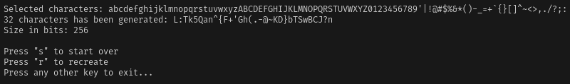

```
██████╗     ██████╗    ██████╗
██╔══██╗   ██╔════╝   ██╔════╝
██████╔╝   ██║        ██║  ███╗
██╔══██╗   ██║        ██║   ██║
██║  ██║██╗╚██████╗██╗╚██████╔╝
╚═╝  ╚═╝╚═╝ ╚═════╝╚═╝ ╚═════╝
```

##### A.K.A: _Random Character Generator_

### What is RCG?
Rcg or Random Character Generator is a FOSS software that generates randomic characters, like letters,
numbers and symbols according to the inserted size and the type of characters selected, all through the input.



### Dependencies
RCG was tested on linux x86_64 based OS, it will be necessary to download some dependencies if wasn't installed yet.

```sh
# using apt (debian based distros)
sudo apt install libncurses-dev make
```

```sh
# using pacman (arch linux based distros)
sudo pacman -S ncurses make
```

### Installation
Follow the steps described below to download and install rcg.

```sh
# cloning the repository on the HOME directory 
cd $HOME
git clone (url of the project)

# enter the directory
cd rcg/

# compile the software
make
```
To execute the software (linux) follow the orientations below.

```sh
# running globally
rcg
```

```sh
# running locally
cd $HOME/rcg
make run
```